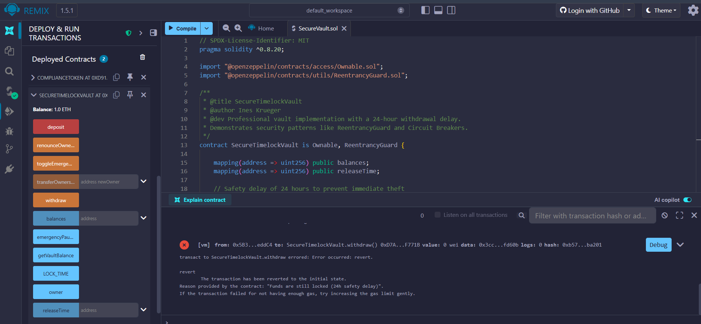

# 🛡️ Secure DeFi Timelock Vault
**Demonstrating Smart Contract Security & Asset Protection**

## Project Overview
This repository contains a professional Ethereum vault designed to protect assets. It implements a mandatory 24-hour withdrawal delay to prevent immediate theft if a private key is compromised.

## Key Security Features
- **24h Timelock:** Prevents instant withdrawals, providing a critical reaction window.
- **Reentrancy Protection:** Implements OpenZeppelin's `ReentrancyGuard` to prevent recursive call attacks.
- **Emergency Pause:** Includes a circuit breaker function for administrators to freeze assets during threats.
- **Access Control:** Secured via the `Ownable` pattern.

## Technical Proof (Security Test)
The following screenshot demonstrates the vault's security logic in action. An attempt to withdraw funds immediately after depositing results in a transaction revert, as the 24-hour lock is active:

*(Image: Remix IDE console showing the "Funds are still locked" error during a security test)*

## Deployment & Tech Stack
- **Language:** Solidity 0.8.20
- **Library:** OpenZeppelin (Security Standards)
- **Environment:** Remix IDE / EVM-compatible
